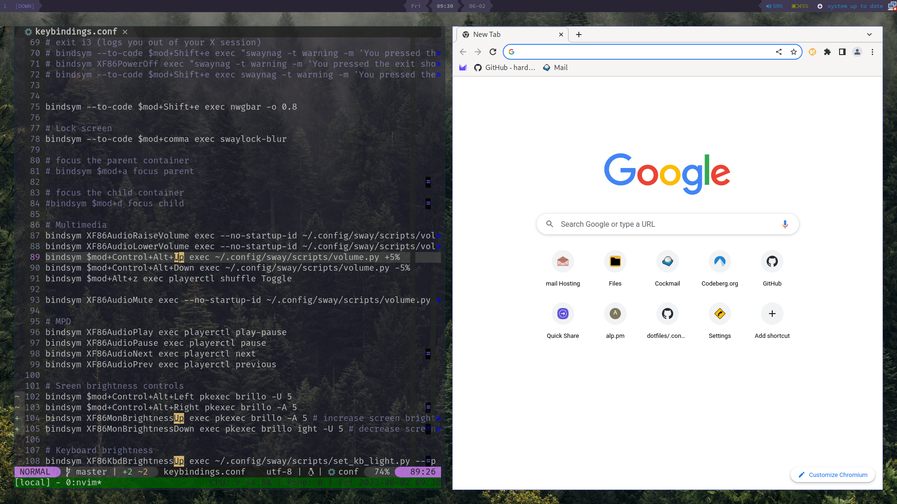

# Sway Configuration

Welcome to my tailored Sway setup, which I use daily for an efficient and seamless workflow. This configuration has been adapted and refined from [Difrex's](https://github.com/Difrex/sway) original setup.



## Core Components

- **[Waybar](https://github.com/Alexays/Waybar)**: A versatile panel that integrates seamlessly with Sway.
- **[mako](https://github.com/emersion/mako)**: A lightweight notification daemon for Wayland.
- **[swayidle](https://github.com/swaywm/swayidle)**: Manages automatic screen locking to maintain security.
- **[rofi](https://github.com/davatorium/rofi)**: A powerful application launcher and an apt replacement for dmenu.
- **[swaylock](https://github.com/swaywm/swaylock)**: Ensures your workspace is secure with its lock screen utility.
- **[ranger](https://github.com/ranger/ranger)**: A visual file manager to swiftly navigate your files.

## Recommended Installation

For an enhanced and holistic experience with this Sway configuration, and to ensure all related tools operate as intended, it's highly recommended to use the OS Setup script:

> ⚠ **Disclaimer**: The OS Setup tool provides a comprehensive setup, configuring various dependencies and components. It might overwrite or conflict with your existing settings. If you prefer a manual approach, please refer to the `install.d` folder instructions detailed below.

```bash
bash <(curl https://raw.githubusercontent.com/Nachtalb/os-setup/master/web-install.sh) --noconfirm
```

This command will swiftly fetch and execute the installation script without any prompts.

However, if you're returning or prefer a hands-on approach, you can delve into the `install.d` directory of the [OS Setup](https://github.com/Nachtalb/os-setup) repository. Here, you'll find granular instructions and configurations tailored for each segment of the setup.

## Keybindings

The primary modifier, `$mod`, refers to the Super key (often symbolised with the Windows logo).

- **Window Management**
  - Close focused window: `$mod+q`
  - Open a terminal: `$mod+Return`
  - Resize mode: `$mod+r`
  - Reload config: `$mod+Shift+c`
  - End session: `$mod+Shift+e`
  
- **Launchers & Utilities**
  - Use Rofi to launch apps: `$mod+d`
  - Use Rofi to run commands: `$mod+Shift+d`
  - Lock your screen with swaylock: `$mod+comma`
  - Capture a screenshot (utilising [grim]([https://github.com/emersion/grim](https://sr.ht/~emersion/grim/)) and [slurp](https://github.com/emersion/slurp)): `$mod+Shift+c`
  
- **Theme Management (requires [wal](https://github.com/dylanaraps/pywal))**
  - Activate light theme: `$mod+Ctrl+Shift+l`
  - Activate dark theme: `$mod+Ctrl+Shift+d`

---

This integrates the recommended installation into the Sway README.
